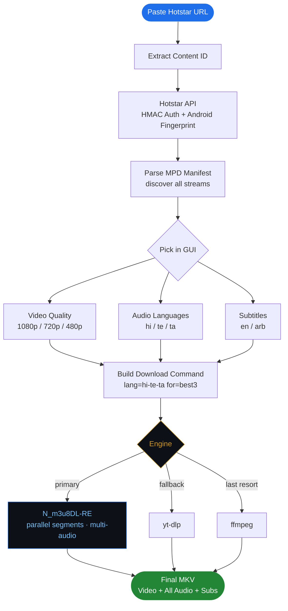

# JioHotstar Downloader

<p align="center">
  <a href="https://github.com/arvind88765/hotstar-downloader/stargazers">
    
  </a>
  <a href="https://github.com/arvind88765/hotstar-downloader/network/members">
    
  </a>
  
  
</p>

<p align="center">
  <b>⭐ if this saved you time, drop a star. takes 1 second and means a lot ⭐</b>
</p>

---

download jiohotstar episodes with a clean GUI. no DRM, no Widevine, no sketchy key extractors. hotstar VOD is just plain unencrypted DASH so you can grab it directly.

> **disclaimer**
> this is for educational and personal use only. downloading content may go against hotstar's ToS. no encryption is bypassed here. do not redistribute downloaded content. use at your own risk.

---

## demo

<!-- drop your video link below once you upload it -->

https://github.com/user-attachments/assets/YOUR-VIDEO-ID-HERE

> upload your demo `.mp4` to this repo (drag into any issue or PR) and GitHub gives you an `assets/...` URL, paste it above and delete this line

---

## what it does

- OTP login via your phone number, no password needed
- fetches all available qualities with size estimates before you download
- custom checkbox picker, tick what you want. video quality, audio languages, subtitles
- smart filenames like `Bigg_Boss_Day_12_1080p_H264.mkv`
- cancel button mid-download
- dark theme GUI, no terminal needed after setup
- **N_m3u8DL-RE is the primary engine.** parallel segments, multi-audio, stupid fast. set it up first, everything else is just backup
- download priority: N_m3u8DL-RE → yt-dlp → ffmpeg (fastest to slowest)
- multi-language audio in one MKV. tick hi + te + ta and all three land at highest bitrate, only works properly with N_m3u8DL-RE

---

## how it works



---

## requirements

- Python 3.9+
- pip (comes with Python)
- ffmpeg (for fallback)
- yt-dlp (auto-installs itself on first run)
- N_m3u8DL-RE (optional, fastest)

---

## setup

### 1. install Python

grab it from [python.org/downloads](https://www.python.org/downloads/)

when installing, tick **"Add Python to PATH"** or nothing will work

check it worked:
```
python --version
```

### 2. clone or download this repo

```bash
git clone https://github.com/arvind88765/hotstar-downloader.git
cd hotstar-downloader
```

or just hit `Code -> Download ZIP` and extract it

### 3. install dependencies

```bash
pip install -r requirements.txt
```

that installs `requests` and `yt-dlp`. tkinter comes with Python already.

### 4. install ffmpeg

ffmpeg is a fallback downloader. if you have N_m3u8DL-RE or yt-dlp works fine, you might not even need it. but good to have.

**windows:**
1. download from [gyan.dev/ffmpeg/builds](https://www.gyan.dev/ffmpeg/builds/) -- grab `ffmpeg-release-full.7z`
2. extract somewhere like `E:\ffmpeg\`
3. add `E:\ffmpeg\bin` to your system PATH
   - search "environment variables" in start menu
   - click "Edit the system environment variables"
   - click "Environment Variables"
   - under System Variables find `Path`, click Edit
   - click New and paste `E:\ffmpeg\bin`
   - hit OK everywhere
4. open a new terminal and run `ffmpeg -version` to confirm

alternatively skip all that and just paste the full path (`E:\ffmpeg\bin\ffmpeg.exe`) in the Settings tab inside the app

### 5. N_m3u8DL-RE ⚡ (do this first, seriously)

this is the main engine. parallel segments, multi-audio MKV, accurate bitrate selection. all of that only happens with this. yt-dlp and ffmpeg are just safety nets.

on a 90 Mbps connection a 1 hour episode takes like 20 seconds. with ffmpeg alone that's 3+ minutes.

**multi-audio only works with N_m3u8DL-RE.** if you skip this step and tick 3 audio languages, you'll only get one track.

1. go to [github.com/nilaoda/N_m3u8DL-RE/releases](https://github.com/nilaoda/N_m3u8DL-RE/releases)
2. download `N_m3u8DL-RE_Beta_win-x64.zip`
3. extract `N_m3u8DL-RE.exe` wherever, like `E:\N_m3u8DL-RE.exe`
4. open the app → Settings tab → paste the path in the N_m3u8DL-RE field → Save

done. now it runs first every time.

---

## usage

run it:
```bash
python hotstar_gui.py
```

**Login tab**
- enter your 10 digit Indian phone number (no +91)
- hit Send OTP
- enter the OTP you get on SMS
- hit Verify & Login
- token saves automatically, valid for around 20 hours

**Download tab**
- paste a hotstar URL or just the content ID
- click Fetch Qualities
- tick the quality you want (size estimates shown)
- tick audio languages and subtitles you want
- set your output folder
- hit Download
- cancel button shows up while downloading if you need to stop

**Settings tab**
- set default output folder, ffmpeg path, N_m3u8DL-RE path, thread count
- choose download engine: Auto / N_m3u8DL-RE / yt-dlp / ffmpeg
- save settings

---

## supported URLs

```
https://www.hotstar.com/in/shows/bigg-boss/14714/episode-name/1271702138/watch
https://www.hotstar.com/in/shows/bigg-boss/14714/episode-name/1271702138
1271702138
```

---

## download speed

| tool | method | speed on 90 Mbps | multi-audio |
|---|---|---|---|
| **N_m3u8DL-RE** ⚡ | parallel segments | ~10–20 sec per episode | ✅ yes, all langs at max bitrate |
| yt-dlp | concurrent fragments | ~20–40 sec per episode | ⚠️ limited |
| ffmpeg | sequential, one segment at a time | ~3–5 min per episode | ❌ no |

**N_m3u8DL-RE runs first, always.** set it up in Settings. yt-dlp and ffmpeg only kick in if it's not configured or fails.

---

## multi-audio MKV

when you tick multiple audio languages in the GUI, N_m3u8DL-RE uses:

```
--select-audio "lang=hi|te|ta:for=best3"
```

this picks the top 3 tracks by bandwidth, one per language at max bitrate, and muxes them all into a single MKV. fully dynamic, works for any number of languages the content has.

---

## output filenames

auto-generated from content metadata:

```
Bigg_Boss_Bbtel_Day_12_New_King_1080p_H264.mkv
```

format: `ShowName_EpisodeName_Quality_Codec.mkv`

---

## troubleshooting

**"no valid token"**
login again, token lasts around 20 hours

**only shows "best available (auto)" instead of quality list**
MPD fetch failed, try clicking Fetch Qualities again

**download is really slow**
yt-dlp probably is not installed. run `pip install yt-dlp` and restart the app

**OTP not arriving**
wait 60 seconds then click Resend OTP. make sure there is no +91 prefix

**app crashes on startup**
make sure you ran `pip install -r requirements.txt` first

---

## files

```
hotstar_gui.py       the main GUI app, run this
requirements.txt     pip install -r this
```

token and config files are auto-created in the same folder when you use the app. they are in `.gitignore` so they never get committed.

---

## disclaimer (again)

this tool does not bypass any DRM or encryption. it only downloads streams that hotstar already serves without encryption. redistribution of copyrighted content is illegal. personal use only.

---

made by **Rvind**
